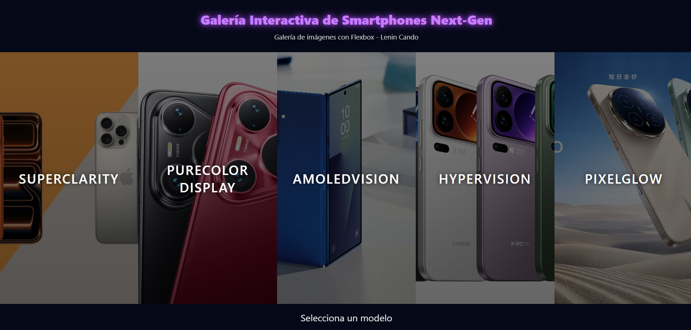

INGENIERIA WEB
Nombre: Lenin Andrey Cando Arequipa
# Galería Interactiva con Flexbox Reto 5 – Reto JavaScript30

## Nombre del reto seleccionado
Flex Panels Image Gallery 

## Descripción del objetivo del reto
Este proyecto consiste en la implementación de una galería interactiva de paneles utilizando únicamente HTML, CSS y JavaScript. El objetivo es replicar el funcionamiento del reto “Flex Panels Image Gallery” del curso JavaScript30, aplicando Flexbox para la distribución de los paneles y JavaScript para manejar la interacción, animaciones y contenido dinámico.  
Además, se incorporaron mejoras propias como la visualización de información del modelo al seleccionar un panel y la capacidad de ocultarla al volver a hacer clic.

## Tecnologías utilizadas
- HTML5  
- CSS3 (Flexbox, animaciones y estilos avanzados)  
- JavaScript (manipulación del DOM e interactividad)  

## Capturas de pantalla o GIF


## Instrucciones para ejecutar localmente

1. Clonar este repositorio:
   ```bash
   git clone https://github.com/Leninmax27/RetoJavaScriptLC.git

2. cd RetoJavaScriptLC
3. Abrir el archivo index.html en el navegador web. No se requiere instalación adicional, ya que el proyecto funciona únicamente con HTML, CSS y JavaScript puro.

## LINK DEL DEPLOY
https://leninmax27.github.io/RetoJavaScriptLC/ 